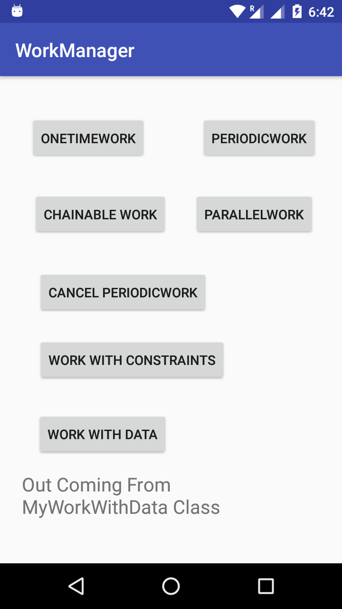
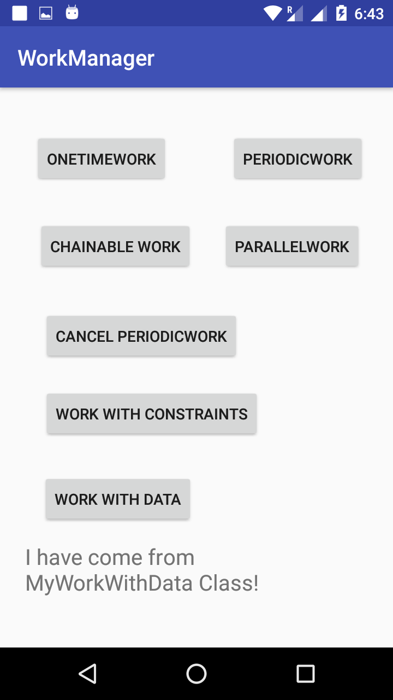
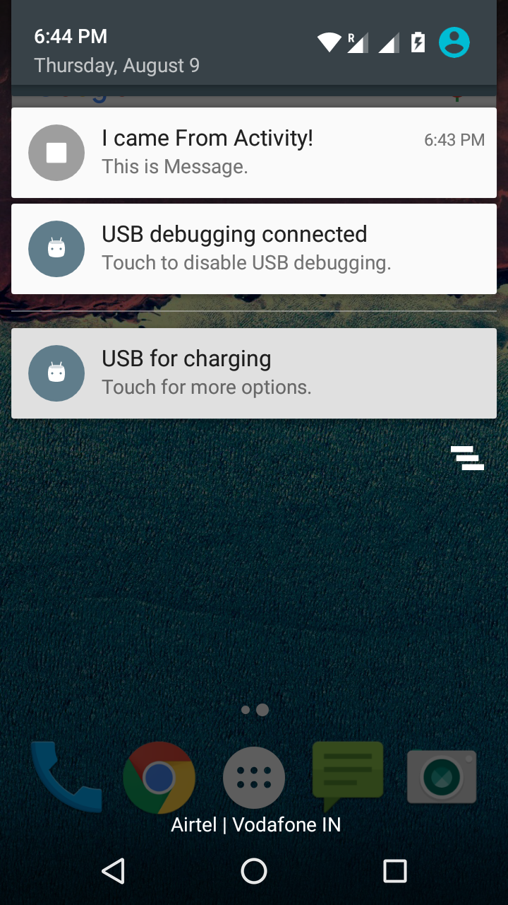

# WorkManager Example Andorid.

How to use WorkManager in Android. This is new way to run background tasks in android and also the best way.

- It show's you:-

1) How to perform OneTimeWorkRequest.
2) How to perform PeriodicWorkRequest.
3) How to perform parallel task.
4) How to perform task one after other.
5) How to cancel runing task.
6) How to get work status weather work completed or Not.
7) How to use Constraints for conditions.
8) How to send Data from Activity to your Own Worker Class and Also How to send that data back to the Activity from your Own Worker Class.
9) How send notification using WorkManager.

### Note:-

To See Output you have to see logs in Android Studio.

### Reference:-

1) https://www.youtube.com/watch?v=fAQKvBHeg_w
2) https://www.youtube.com/watch?v=1VVir3-4hII
3) https://www.youtube.com/watch?v=0jgkQYebYvQ
4) https://www.youtube.com/watch?v=ooP8kkhvRQI
5) http://thetechnocafe.com/how-to-use-workmanager-in-android/

## Screenshots:-

  

